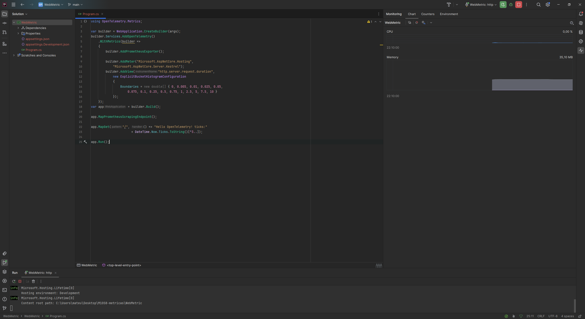
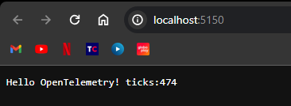
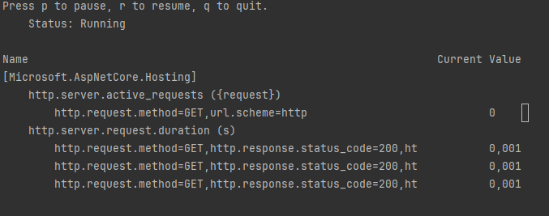
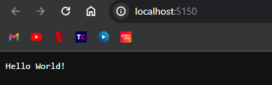
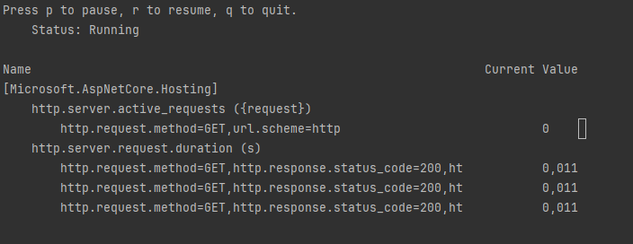
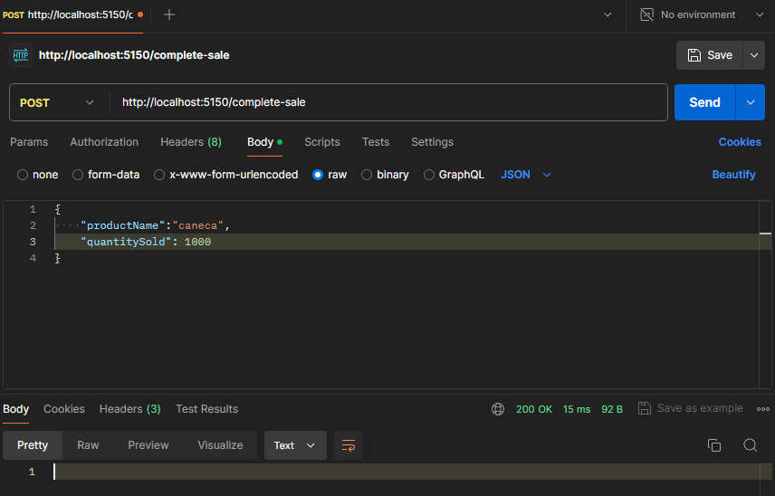
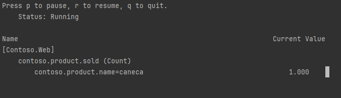
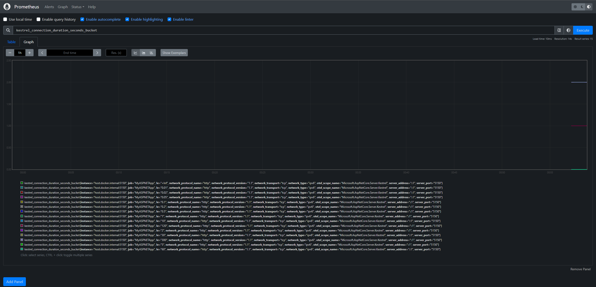
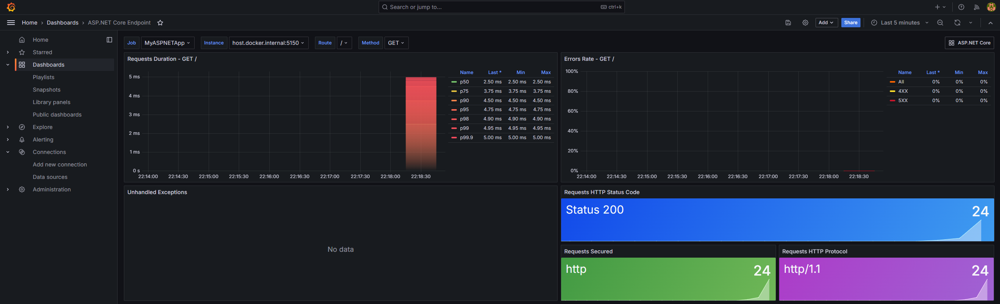

# M10S8-metricas

## Dependencias
- .Net Core 8.0
- Docker
- Grafana
- Prometheus


## Iniciando o projeto

```bash
dotnet new web -o WebMetric
cd WebMetric
dotnet add package OpenTelemetry.Exporter.Prometheus.AspNetCore --prerelease
dotnet add package OpenTelemetry.Extensions.Hosting
```
Substitua o arquivo Program.cs por:

```csharp
using OpenTelemetry.Metrics;

var builder = WebApplication.CreateBuilder(args);
builder.Services.AddOpenTelemetry()
    .WithMetrics(builder =>
    {
        builder.AddPrometheusExporter();

        builder.AddMeter("Microsoft.AspNetCore.Hosting",
                         "Microsoft.AspNetCore.Server.Kestrel");
        builder.AddView("http.server.request.duration",
            new ExplicitBucketHistogramConfiguration
            {
                Boundaries = new double[] { 0, 0.005, 0.01, 0.025, 0.05,
                       0.075, 0.1, 0.25, 0.5, 0.75, 1, 2.5, 5, 7.5, 10 }
            });
    });
var app = builder.Build();

app.MapPrometheusScrapingEndpoint();

app.MapGet("/", () => "Hello OpenTelemetry! ticks:"
                     + DateTime.Now.Ticks.ToString()[^3..]);

app.Run();
```

Execute o projeto utilizando: dotnet run


Testando o endpoint:


Instale o dotnet-counters:

```bash
dotnet tool update -g dotnet-counters
```

Colete as métricas utilizando o:
```bash
dotnet-counters monitor -n WebMetric --counters Microsoft.AspNetCore.Hosting
```
Resultado das métricas:


## Enriquencendo as métricas

Substitua o arquivo Program.cs por:
```csharp
using Microsoft.AspNetCore.Http.Features;

var builder = WebApplication.CreateBuilder();
var app = builder.Build();

app.Use(async (context, next) =>
{
    var tagsFeature = context.Features.Get<IHttpMetricsTagsFeature>();
    if (tagsFeature != null)
    {
        var source = context.Request.Query["utm_medium"].ToString() switch
        {
            "" => "none",
            "social" => "social",
            "email" => "email",
            "organic" => "organic",
            _ => "other"
        };
        tagsFeature.Tags.Add(new KeyValuePair<string, object?>("mkt_medium", source));
    }

    await next.Invoke();
});

app.MapGet("/", () => "Hello World!");

app.Run();
```
Rode o projeto utilizando o comando: dotnet run

Testando o endpoint com o nomo código:



Coletando as métricas do novo endpoint:



## Métrica Personalizada

Crie um arquivo chmado ContosoMetrics.cs e adicione esse código:
```csharp
using System.Diagnostics.Metrics;

namespace WebMetric;

public class ContosoMetrics
{
    private readonly Counter<int> _productSoldCounter;

    public ContosoMetrics(IMeterFactory meterFactory)
    {
        var meter = meterFactory.Create("Contoso.Web");
        _productSoldCounter = meter.CreateCounter<int>("contoso.product.sold");
    }

    public void ProductSold(string productName, int quantity)
    {
        _productSoldCounter.Add(quantity,
            new KeyValuePair<string, object?>("contoso.product.name", productName));
    }
}
```

Altere o arquivo Program.cs por:
```csharp
using WebMetric;
using WebMetric.Models;

var builder = WebApplication.CreateBuilder(args);

builder.Services.AddSingleton<ContosoMetrics>();

var app = builder.Build();

app.MapPost("/complete-sale", (SaleModel model, ContosoMetrics metrics) =>
{
    metrics.ProductSold(model.ProductName, model.QuantitySold);
});

app.Run();
```

Crie o arquivo SaleModel.cs:
```csharp
namespace WebMetric.Models;

public class SaleModel
{
    public string ProductName { get; set; }
    public int QuantitySold { get; set; }
}
```

Testando o novo endpoint:



Coletando as métricas do novo endpoint:



## Conectando com o Prometheus e Grafana

Após a conexão com o Prometheus vamos utiliar a métrica: http_server_request_duration_seconds_count


E por fim fazendo a conexão com o Grafa e importando um template para o grafana:

